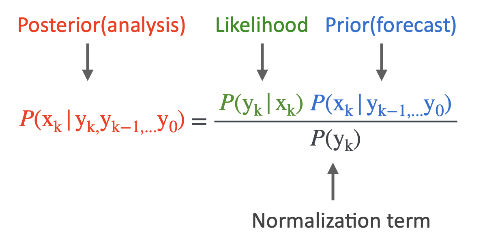

# RL4DA_MXM

## 1. Intro to Data Assimilation
For a complex dynamical system, we have dynamical models (usually numerical models) and observations of the system states. In practice, neither models nor observations can perfectly describe the system states. Model predictions are imperfect due to model errors, uncertain initial conditions, numerical errors, and so on. Observations are usually partial and noisy. Data assimilation aims to get a better (if not optimal) estimate of the system states by combining the information from both models and observations.

Bayes' theorem is the most general theoretical foundation of data assimilation. Meanwhile, the Bayes' theorem is so clean in form thus a perfect cut-through point.

  
    
  <figcaption>Figure 1. Bayes' formula. k denotes the discrete-time indices, y denotes observations, and x denotes the unobserved states to be filtered. </figcaption>

If both the prior distribution and likelihood are Gaussian, then the posterior is also Gaussian given by the well-celebrated Kalman Filter solution. 

But the Gaussian assumption only holds in linear cases, when the dynamical system is a linear Gaussian process. Although in some cases, nonlinearity of y is allowed while the system has a certain conditional Gaussian structure [(see Conditional Gaussian Nonlinear Systems, if interested)](https://www.mdpi.com/1099-4300/20/7/509). A lot of efforts are made to apply the filtering in nonlinear cases. Ensemble Kalman Filter (EnKF) is one of the nonlinear filters (but not completely nonlinear or truly nonlinear, why?). [Here](https://ww2.mathworks.cn/videos/understanding-kalman-filters-part-4-optimal-state-estimator-algorithm--1493129749201.html) is a good tutorial by Matlab introducing the Kalman Filter, Extended Kalman Filter, and EnKF. [Here](https://www.youtube.com/watch?v=GofCsx2apP4&t=1928s) is another tutorial introducting EnKF as well as the basic ideas of data assimilation by Jeff Anderson from NCAR.

### 1.1 Practical Examples
1. Lorenz 63 system with EnKF  
   [The Lorenz 63 system](https://en.wikipedia.org/wiki/Lorenz_system) is a classical toy model that was introduced by Edward Lorenz in 1963. It is a ODEs system that involving only three variables, yet enough to be chaotic. The data assimilation [code](https://github.com/zhongruiw/RL4DA_MXM/tree/main/enkf_L63) shows the skeleton of EnKF, working well in this low-dimension model and relatively simple settting.
2. Lorenz 96 system with EnKF  
   [The Lorenz 95 system](https://docs.dart.ucar.edu/en/latest/models/lorenz_96/readme.html) is another model introduced by Edward Lorenz. It describes model variables in a circular grids. The [code](https://github.com/zhongruiw/RL4DA_MXM/tree/main/enkf_L96) provides a more practical version of EnKF that scales to higher dimensions, with a few tricks introduced: serial update of observations, covariance localizaiton and inflation. There is also a prototype code for L96. You will need to fill in the missings.

### 1.2 Other Resources
[The DART tutorial](https://dart.ucar.edu/tutorials/dart-tutorial/)  
[Math 717 slides on data assimilation](https://github.com/zhongruiw/RL4DA_MXM/tree/main/references/Math717slides) by Nan Chen  
There is also a book: [Stochastic Methods for Modeling and Predicting Complex Dynamical Systems](https://link.springer.com/book/10.1007/978-3-031-22249-8) by Nan Chen  
[Data Assimilation Foundamentals](https://link.springer.com/book/10.1007/978-3-030-96709-3)by Geir Evensen , Femke C. Vossepoel , Peter Jan van Leeuwen]  
[Data Assimilation: A Mathematical Introduction](https://link.springer.com/book/10.1007/978-3-319-20325-6) by Kody Law , Andrew Stuart , Konstantinos Zygalakis
